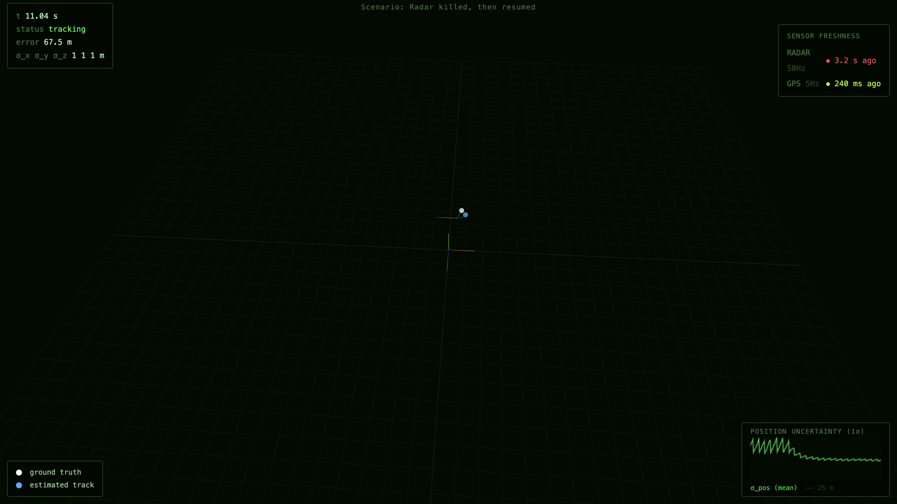

# Air Traffic Control Tracker



Your tracker fuses radar (50 Hz, noisy) with a GPS transponder (5 Hz, accurate) to follow aircraft through 3D airspace, and keeps working when one of the sensors dies.

The sim, the sensors, the Kalman filter, the visualization, and all the inter-process plumbing are provided. Your job is the architecture: reading from sensors that run at different rates without blocking, checking freshness before trusting a reading, and falling back to known-safe behavior when a feed goes stale. The whole assignment lives in one file, one method, a few dozen lines; the wrong structure fails visibly.

## Setup

```bash
conda env create -f environment.yml
conda activate atc-tracker
```

## What you're working with

The harness runs three processes: a radar sim, a GPS transponder sim, and your tracker. Each sensor writes its latest observation to a shared slot; your tracker reads from them and writes its output to a third slot. The visualization reads that output and renders a live 3D view.

**Radar** runs at 50 Hz with σ = 15 m noise (fast and always present, but each reading is rough). **GPS transponder** runs at 5 Hz with σ = 2 m (precise, but you wait 200 ms between fixes). This is the same tradeoff as IMU and GPS on a real aircraft: one sensor gives you frequency, the other gives you accuracy.

A [Kalman filter](kalman/reference.py) is provided. `kalman.predict(state, dt)` coasts the track forward without new data; `kalman.update(state, obs)` fuses a fresh observation. You call these; you don't build them.

## What you implement

One file: `tracker/node.py`. Open it; the stub wires up the slots and explains what `tick()` needs to do.

The publish rate matters: anything that drops below 40 Hz (including blocking on a sensor read) fails the scenario.

## Grading

Six scenarios run on every push. You pass when ≥ 6/7 produce the expected outcome. Hidden scenarios use different trajectories, fault timings, and noise levels; you can't hardcode to the visible configs.

| # | Scenario | What's checked |
|---|----------|----------------|
| 1 | Nominal (easy) | RMSE < 50 m, output ≥ 40 Hz |
| 2 | GPS transponder killed at t=10 s | Tracks hold on radar alone; no `TRACK_LOST` while radar is live |
| 3 | Radar killed t=8→14 s | Track survives on GPS during gap, re-converges after radar returns |
| 4 | All sensors killed | `TRACK_LOST` declared within 2 s of both dying (by t=13 s) |
| 5 | GPS transponder jittered ±100 ms | No false `TRACK_LOST`; jittery-but-present is not stale |
| 6 | Interface swap (radar at 10 Hz, GPS at 1 Hz) | RMSE < 50 m; hardcoded thresholds fail immediately |
| 7 | GPS killed at t=5, sharp turn at t=15 | No TRACK_LOST; post-turn RMSE < 80 m |

## The freshness problem

The tricky part isn't the Kalman calls; it's knowing when to trust a reading.

Consider scenario 2: the GPS transponder dies at t=10 s. After that, `gps_slot.read()` keeps returning the last observation it ever wrote, and that observation's timestamp never advances. Checking `obs.t > self.last_gps_t` (the standard "is this new?" test) correctly returns `False` every tick. But you also need the time-since-last-observation check: if you haven't seen a new GPS fix in more than `stale_gps_after_s` seconds, stop trusting GPS entirely and run on radar alone.

Now consider scenario 5: the GPS transponder is alive but jittering, with frames arriving ±100 ms off the normal 200 ms gap. Worst case, you might wait ~300 ms between fixes. If your staleness threshold is too tight, scenario 5 triggers `TRACK_LOST` even though the sensor is healthy. Too loose, and scenario 4 (both sensors genuinely die) doesn't detect the failure in time.

The thresholds are provided in the stub (`10 / config.radar_hz`, `5 / config.gps_hz`). The multipliers are generous on purpose: fault injection runs through the multiprocessing Manager, which briefly backs up IPC at the exact moment a fault fires and can prevent the sensor worker from writing for several ticks even though the sensor is still alive. A tight threshold produces false `TRACK_LOST` events right when the fault triggers. Scenario 6 is still a useful check that you haven't hardcoded a raw number — the thresholds are derived from config so they scale with whatever rates the harness uses.

## Running locally

```bash
# Single scenario, headless:
python run.py --scenario 1

# Single scenario with 3D visualization:
python run.py --scenario 1 --visualize
# → opens http://localhost:8080, press S in browser to start

# All visible scenarios:
python run_tests.py

# Full autograder emulation:
python run_tests.py --grade
```

Open `http://localhost:8080` and press `S` to start. The sensor freshness strip (top right) shows how recently each sensor produced data: radar stays near 0 ms, GPS cycles 0 to 200 ms. In fault scenarios the dead sensor goes red. The uncertainty ellipsoid tells you what mode you're in: growing means predict-only, shrinking means you just fused an observation, gone means `TRACK_LOST`.

## Data flow

The harness runs three processes. Two are sensors; one is your tracker.

```
sim/world.py  (true aircraft position)
      │
      ├─ radar_worker  50 Hz  σ=15 m  ──writes──▶  radar_slot (SharedSlot)
      │                                                    │
      └─ gps_worker     5 Hz  σ=2 m   ──writes──▶  gps_slot  (SharedSlot)
                                                          │
                                               Tracker.tick()  50 Hz
                                               reads both slots
                                               fuses via kalman.predict / .update
                                               writes TrackedState
                                                          │
                                    ┌─────────────────────┴──────────────────┐
                                 output_slot                             output_slot
                                    │                                        │
                               viz server ──WebSocket──▶ browser        grader ──▶ pass/fail
```

`SharedSlot` is a latest-value store. Each sensor process overwrites its slot on every tick; your tracker reads from both on every tick. There is no queue: if you call `read()` twice without the sensor writing in between, you get the same observation back. That is by design, and it is why checking `obs.t > self.last_sensor_t` matters.

Fault injection (scenarios 2–7) is handled by the harness signalling the sensor process to stop writing. The slot keeps returning the last value it ever received and the timestamp stops advancing. Your staleness check is the only thing that distinguishes "sensor running but slow" from "sensor dead."
